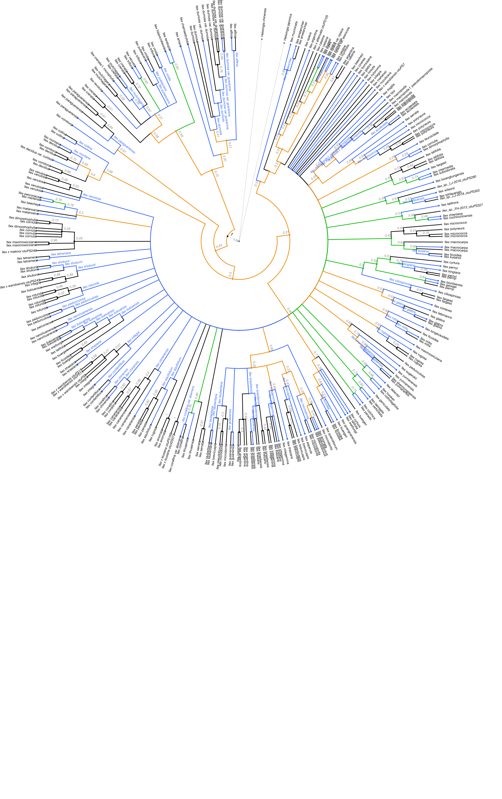
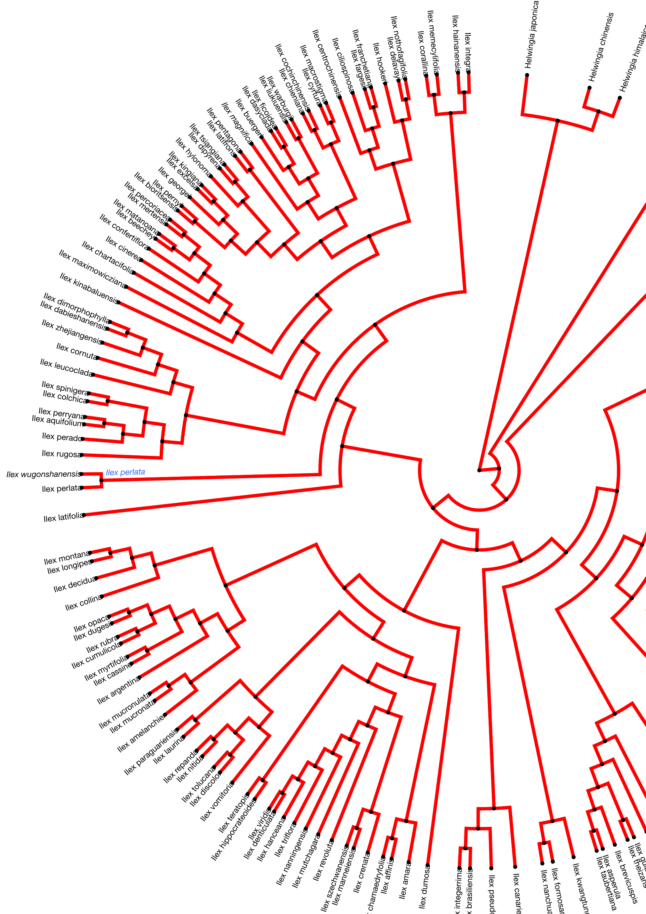

```{r echo = FALSE}
source("../R/plots.R")
updated_sumtree <- ape::read.tree(file = "../data/pg_2827_tree6577/outputs_pg_2827tree6577/physcraper_pg_2827tree6577.tre")
updated_sumtree_drop <- ape::drop.tip(updated_sumtree, c("otu420083", "otu420099"))
updated_sumtree_drop <- ape::ladderize(updated_sumtree_drop)
```

### *Visualizing changes in phylogenetic relationships*

How do the phylogenetic relationships from the updated tree compare to those from the original tree and other *Ilex* trees?

We will use the conflict tool of the OpenTree to visualize this.

The next figure shows in green the nodes resolved by the Gottlieb2005 tree and in blue the nodes that align with taxonomy:
```{r ilex-conflict-original, echo=FALSE, fig.cap="", out.width = '100%', fig.retina= 2}

knitr::include_graphics("ilex-tree6577-conflict-vs-taxonomy.png")
```


The following figure shows results from the conflict analysis in the updated *Ilex* tree. The blue nodes either align with phylogenetic relationships from the Gottlieb2005 tree or with taxonomy; the green nodes (approximately 20) resolve phylogenetic relationships that were not solved by Gottlieb2005; and the orange nodes conflict either with phylogenetic relationships shown in Gottlieb2005 or with taxonomy.

```{r ilex-conflict-updated, echo=FALSE, fig.cap="", out.width = '100%', fig.retina= 2}


```

Let's get the Yao2020 tree:
```{r yao2020}
yao2020 <- rotl::get_study_tree(study_id = "ot_1984", tree_id = "tree1")
```


```{r hist2, message = FALSE, eval = TRUE, dpi = 200, fig.retina = 2, results="asis", out.width="100%",  out.extra='style="background-color: #DCDCDC; padding:10px; display: inline-block;"'}
hist(yao2020$edge.length, col = "skyblue3", breaks = round(max(yao2020$edge.length)),
     border = "skyblue3", xlab= "Branch Length (million years)",
     main = "Yao2020 tree branch length \n frequency distribution")
```

Now we can compare the taxa in the updated Gottlieb2005 and in Yao2020:

```{r yao2020-compare}
comp <- compare(treefile = mytreefile, otufile = myotuinfofile, tree = yao2020)
```

The following figure shows results from the conflict analysis on the Yao2020 tree. Again, the blue nodes align either with Gottlieb2005 or with taxonomy, the green nodes (approximately 80) resolve phylogenetic relationships that were not solved by Gottlieb2005, and the orange nodes conflict either with phylogenetic relationships from Gottlieb2005 or with taxonomy.

```{r ilex-conflict-yao2020, echo=FALSE, fig.cap="", out.width = '100%', fig.retina= 2}


```


With Python:

```
from opentree import OT
import physcraper

gottleib_updated = physcraper.treetaxon.generate_TreeTax_from_run("../physcraperex/data/ilex-local/")
gottleib_updated.write_labelled(path = "gott_taxonlab.tre",label = '^ot:ottTaxonName', norepeats=False)
```

The following generates a tree with tip labels with spaces instead of underscores.
```
yao = OT.get_tree(study_id="ot_1984", tree_id="tree1",tree_format = "newick", label_format='ot:ottTaxonName')
fi = open("yao.tre", "w")
fi.write(yao.response_dict['content'].decode())
fi.close() 
```

Use the tree comparison script:

```
tree_comparison.py -t1 gott_taxonlab.tre -t2 yao.tre -og otu468906 otu1030991 -otu data/pg_2827_tree6577/outputs_pg_2827tree6577/otu_info_pg_2827tree6577.csv -o ilex_comparison

```
