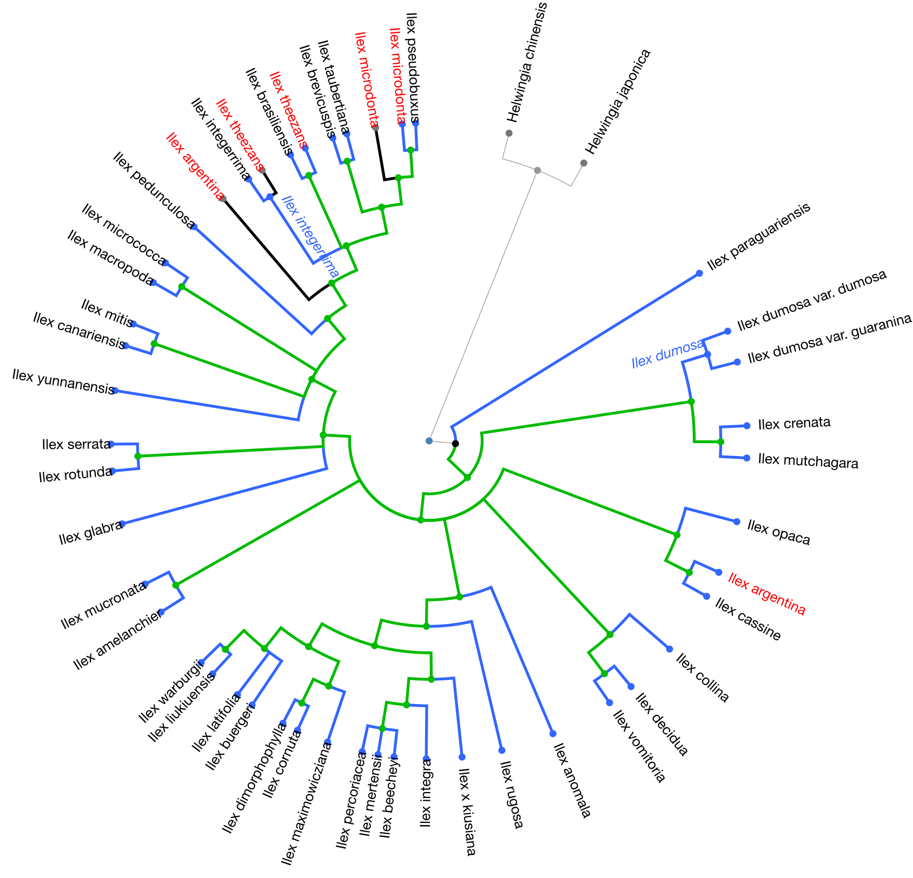
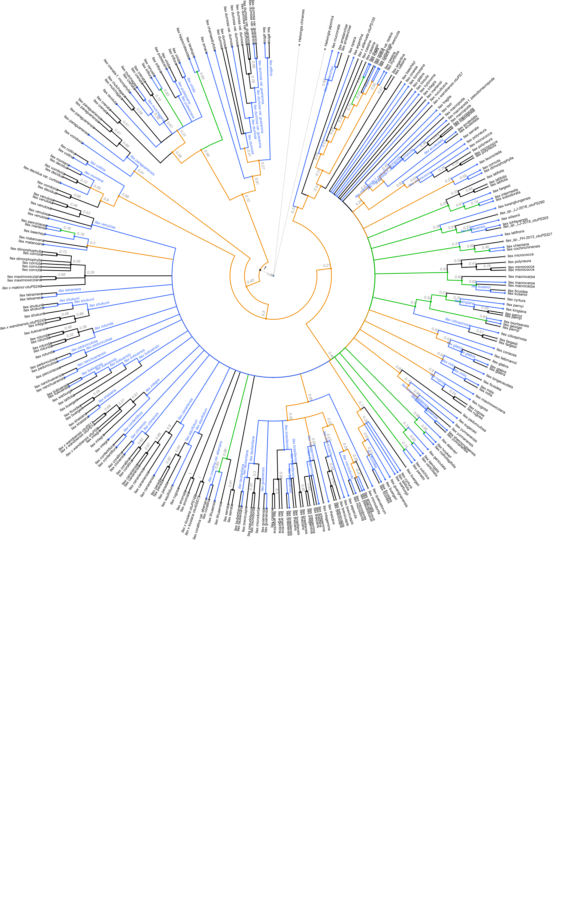
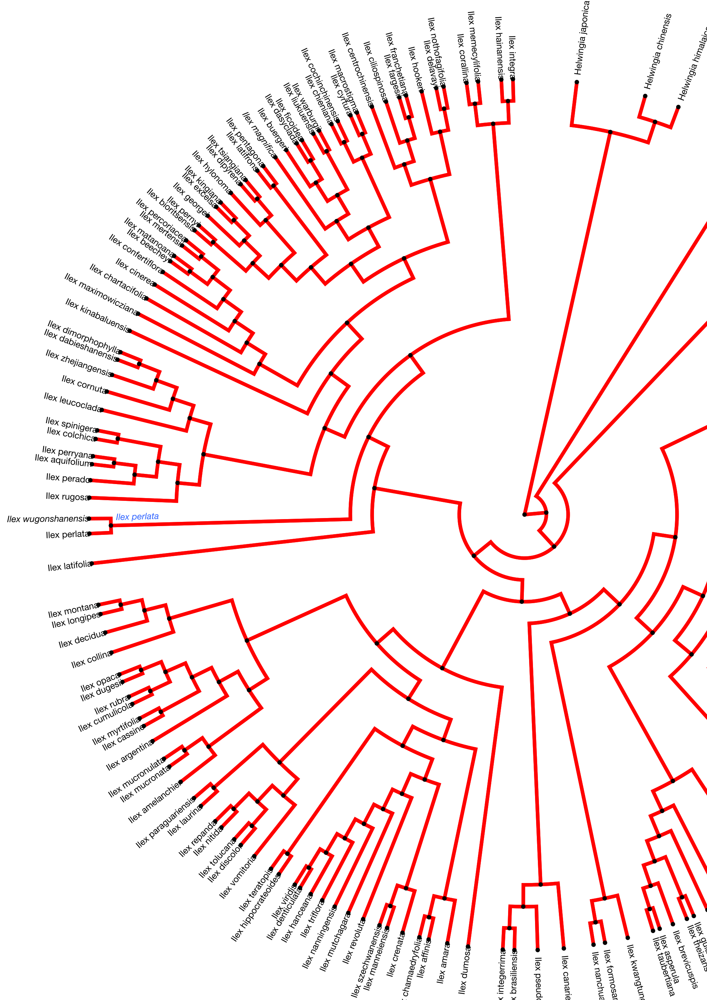

### *Visualizing new tips and taxa*

An easy way to visualize the new tips added into the updated tree compared to the original tree is coloring the tips and branches from those new tips with a highlighting color. We will use a function defined in this package to do so.

The function takes as argument the paths to both the tree and the OTU info files:

```{r arguments}
mytreefile = '../data/pg_2827_tree6577/run_pg_2827tree6577_run4/RAxML_bestTree.2020-07-31'
myotuinfofile = '../data/pg_2827_tree6577/outputs_pg_2827tree6577/otu_info_pg_2827tree6577.csv'
```


And uses `phytools::plotBranchbyTrait`, so it takes all arguments from `ape::plot.phylo`, too:

```{r plot-tips-and-branches, message = FALSE, eval = TRUE, dpi = 200, fig.retina = 2, results="asis", out.width="100%",  out.extra='style="background-color: #DCDCDC; padding:10px; display: inline-block;"', fig.width=2, fig.height=10}
plot_branches(treefile = mytreefile, otufile = myotuinfofile, type = "phylogram", cex = 0.25, edge.width = 0.5, tip_label = "taxon")
mtext(expression(Updated~italic(Ilex) ~ plain("gene tree, after 4 BLAST cycles")), side= 3, line=-1, cex = 0.5)

```
Let's get the summary of new tips:

```{r ilex-summary, message = TRUE, eval = TRUE}
summ <- summarize(treefile = mytreefile, otufile = myotuinfofile)

hist(updated_drop$edge.length, breaks=1400, col = "skyblue3",
     border = "skyblue3", xlab= "Branch Length (substitution rate)",
     main = "Updated Gottlieb2005 tree \n branch length frequency distribution")
```

Even though the updated tree is 99% resolved, `r sum(updated_drop$edge.length<0.01)`
branches are <0.01 and `r sum(updated_drop$edge.length<0.00001)` are < 0.00001, effectively negligible.
The longest branch is `r max(updated_drop$edge.length)` and the smallest
branch is `r min(updated_drop$edge.length)`


### *Visualizing changes in phylogenetic relationships*

How does the phylogenetic relationships from the updated tree compare to those from the original tree and other *Ilex* trees?

We will use the conflict tool of the OpenTree to visualize this.

The next figure shows in green the nodes resolved by the Gottlieb2005 tree and in blue the nodes that align with taxonomy:
```{r ilex-conflict-original, echo=FALSE, fig.cap="", out.width = '100%', fig.retina= 2}


```

The following figure shows results from the conflict analysis in the updated *Ilex* tree. The blue nodes either align with phylogenetic relationships from the Gottlieb2005 tree or with taxonomy; the green nodes (approximately 20) resolve phylogenetic relationships that were not solved by Gottlieb2005; and the orange nodes conflict either with phylogenetic relationships shown in Gottlieb2005 or with taxonomy.

```{r ilex-conflict-updated, echo=FALSE, fig.cap="", out.width = '100%', fig.retina= 2}


```

Let's get the Yao2020 tree:
```{r yao2020}
yao2020 <- rotl::get_study_tree(study_id = "ot_1984", tree_id = "tree1")

hist(yao2020$edge.length, col = "skyblue3", breaks = round(max(yao2020$edge.length)),
     border = "skyblue3", xlab= "Branch Length (million years)",
     main = "Yao2020 tree branch length \n frequency distribution")
```

Now we can compare the taxa in the updated Gottlieb2005 and in Yao2020:

```{r yao2020-compare}
comp <- compare(treefile = mytreefile, otufile = myotuinfofile, tree = yao2020)
```

The following figure shows results from the conflict analysis on the Yao2020 tree. Again, the blue nodes align either with Gottlieb2005 or with taxonomy, the green nodes (approximately 80) resolve phylogenetic relationships that were not solved by Gottlieb2005, and the orange nodes conflict either with phylogenetic relationships from Gottlieb2005 or with taxonomy.

```{r ilex-conflict-yao2020, echo=FALSE, fig.cap="", out.width = '100%', fig.retina= 2}


```
