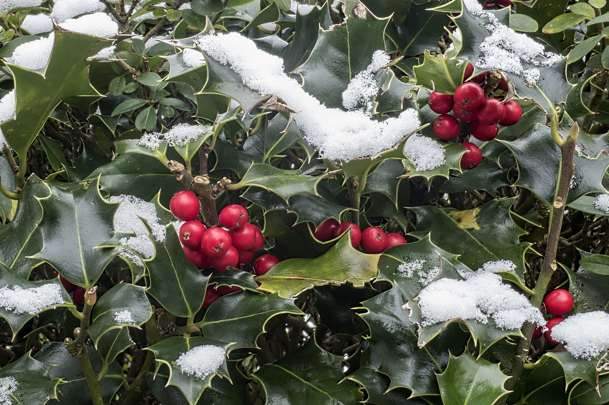

```{r, include = FALSE}
knitr::opts_chunk$set(
  collapse = TRUE,
  comment = "#>",
  fig.path = "../data-raw/ilex-images/"
)
knitr::opts_knit$set(
  global.par = TRUE
  )
```

```{r setup, echo=FALSE}
library(webshot)
source("../R/plots.R")
```


```{r nature, echo=FALSE, fig.cap="*Ilex* fruits and leaves in the snow", out.width = '75%', fig.retina= 2}

```

### [I. Finding a tree to update](ilex-find-a-tree.html)

### [II. Getting the alignment(s)](ilex-get-alignment.html)

### [III. Running Physcraper](ilex-physcraper-run.html)

### [IV. Reading the Physcraper results](ilex-physcraper-res.html)

### [V. Visualizing the Physcraper results](ilex-physcraper-resviz.html)


### Acknowledgments

University of California, Merced cluster, MERCED (Multi-Environment Research Computer for Exploration and Discovery) supported by the National Science Foundation (Grant No. ACI-1429783).

Holly Image by <a href="https://pixabay.com/es/users/WolfBlur-2503887/?utm_source=link-attribution&amp;utm_medium=referral&amp;utm_campaign=image&amp;utm_content=3012084">Wolfgang Claussen</a> at <a href="https://pixabay.com/es/?utm_source=link-attribution&amp;utm_medium=referral&amp;utm_campaign=image&amp;utm_content=3012084">Pixabay</a>

### References
