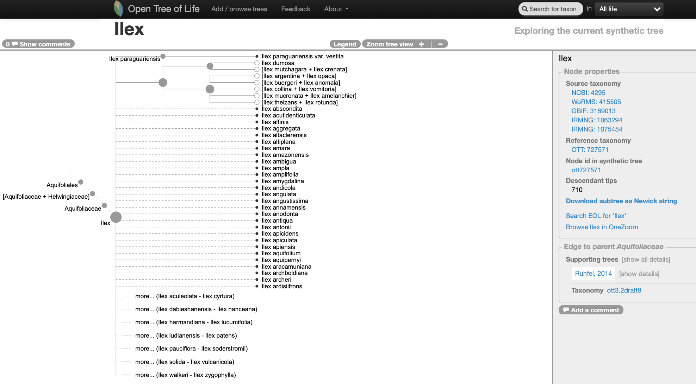
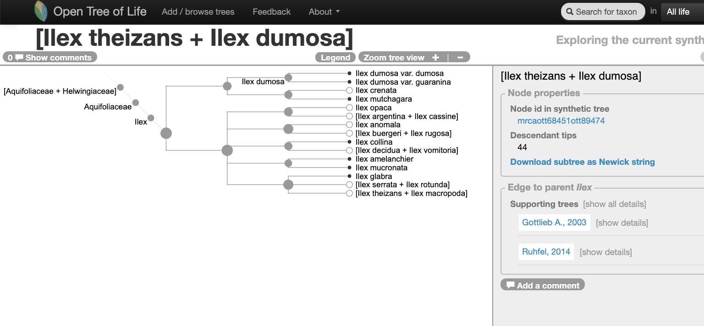
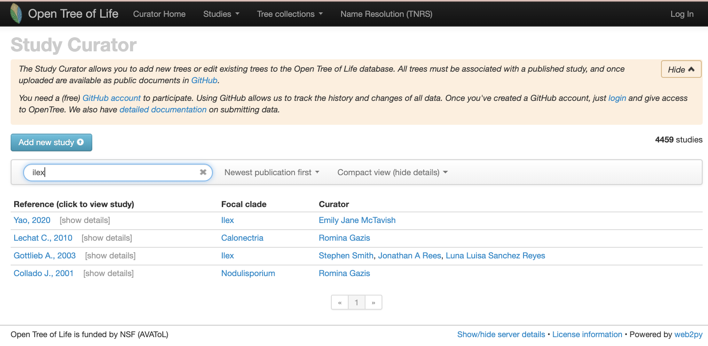

```{r, include = FALSE}
knitr::opts_chunk$set(
  collapse = TRUE,
  comment = "#>"
)
knitr::opts_knit$set(
  global.par = TRUE
  )
```

```{r setup, echo=FALSE}

```
## I. Finding a tree to update

### With the Open Tree of Life website

Go to the [Open Tree of Life website](https://tree.opentreeoflife.org/opentree/argus/opentree12.3@ott93302) and use the "search for taxon" menu to look up the taxon *Ilex*.

This is how the genus *Ilex* is represented on the Open Tree of Life synthetic tree at the middle of year 2020:

```{r ilex-tree-opentree, echo=FALSE, fig.cap="Go to the website and look at it [here](https://tree.opentreeoflife.org/opentree/argus/ottol@727571/Ilex)", out.width = '100%', fig.retina= 2}
# library(webshot)
# webshot("https://tree.opentreeoflife.org/opentree/argus/ottol@727571/Ilex", "ilex-tree-opentree.png")

# webshot did not work on opentree website

```

=====================================

Navigating into the tree, we notice that there might be two studies associated to this portion of the Open Tree synthetic tree.

```{r ilex-tree-opentree-2, echo=FALSE, fig.cap="", out.width = '100%', fig.retina= 2}


```

=======================
Let's verify that on the [study curator of OToL](https://tree.opentreeoflife.org/curator).

Studies matching the word 'ilex' on the curator database, at the middle of year 2020. Some of these studies are not actually about the hollies, but other taxa that have the species epithet *ilex*.

```{r ilex-curation-opentree, echo=FALSE, fig.cap="", out.width = '100%', fig.retina= 2}

```

### With the package `rotl`

<!-- ```{r} -->
<!-- ilex <- rotl::tnrs_match_names(names = "ilex") -->
<!-- ``` -->

<!-- ```{r, results='asis', echo=FALSE} -->
<!-- knitr::kable(ilex, caption = "Taxonomic Name Resolution information for the genus *Ilex*") -->
<!-- ``` -->

<!-- Can we use the *OTT id* to get some trees or studies? -->

<!-- ```{r} -->
<!-- rotl::studies_properties() -->
<!-- ``` -->

Explain what a focal clade is.

There is a handy function that will search a taxon among the focal clades reported across trees.

```{r}
ilex <- rotl::studies_find_studies(property="ot:focalCladeOTTTaxonName", value="Ilex")
```

```{r, results='asis', echo=FALSE}
knitr::kable(ilex, caption = "Studies with the genus *Ilex* as focal clade.")
```

It seems like only one tree is on the Open Tree of Life synthetic tree:

```{r ilex-pg_2827-tree6577, eval = TRUE, fig.retina = 2, fig.width = 2}
# ape::plot.phylo(ape::ladderize(my_trees[[1]]), type = "phylogram", cex = 0.2) 
```


## II. Getting the underlying alignment

### Using physcraper

```
physcraper_run.py -s pg_2827 -t tree6577 -no-est -o data/pg_2827_tree6577
```

### Downloading it manually


## III. Making a run


```
physcraper_run.py -s pg_2827 -t tree6577 -o data/pg_2827_tree6577
```

```
physcraper_run.py -s pg_2827 -t tree6577 -a data-raw/alignments/T1281-M2478.nex -as nexus -o data/pg_2827_tree6577
```

### Using a local BLAST database

```
physcraper_run.py -s pg_2827 -t tree6577 -a data-raw/alignments/T1281-M2478.nex -as nexus -db Volumes/ADATA\ HV620/local_blast_db/ -o data/pg_2827_tree6577 
```

## IV. Reading the results

### The physcraper tag

### Input files

### Run files

The trees are reconstructed using RAxML, with taxon labels corresponding to taxon ids (e.g., otu42009) and not taxon names (e.g., *Helwingia japonica*). Branch lengths are proportional to relative substitution rates.
The RAxML tree with taxon names as taxon labels is saved on the `outputs_tag` folder.

```{r,include=FALSE}
par(mar=c(1,1,1,1), xpd=NA)  # adjust margins for all plots after this
```
```{r, echo=TRUE, out.width='100%', fig.retina=3, dpi=300}
ilex_new_tree <- ape::read.tree(file = "../data/pg_2827_tree6577/run_T1281-M2478/RAxML_bestTree.2020-06-02")
ape::plot.phylo(ape::ladderize(ilex_new_tree), type = "fan", cex = 0.25, label.offset = 0.02, edge.width = 0.5)
```

### Output files

```{r, echo=TRUE, out.width='100%', fig.height= 15, fig.retina=3, dpi=300}
ilex_new_tree_labeled <- ape::read.tree(file = "../data/pg_2827_tree6577/outputs_T1281-M2478/updated_taxonname.tre")
# ape::plot.phylo(ape::ladderize(ilex_new_tree_labeled), cex = 0.35)
```
```{r,include=FALSE}
par(mar=c(1.8,1.7,1.5,1.7), xpd=NA)  # adjust margins for all plots after this
```
```{r, echo=TRUE, out.width='100%', fig.retina=3, dpi=300,  out.extra='style="background-color: #9ecff7; padding:10px; display: inline-block;"'}
ape::plot.phylo(ape::ladderize(ilex_new_tree_labeled), type = "fan", cex = 0.2, label.offset = 0.02, edge.width = 0.5)
```
