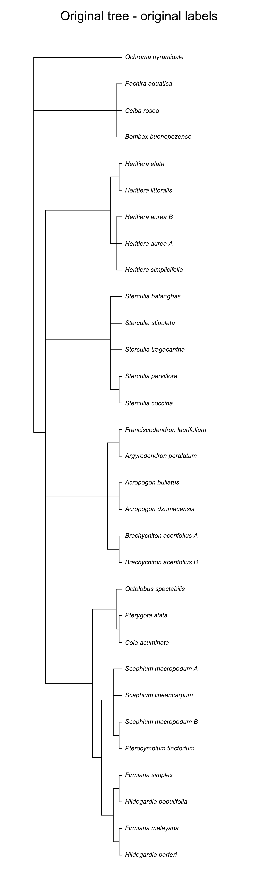
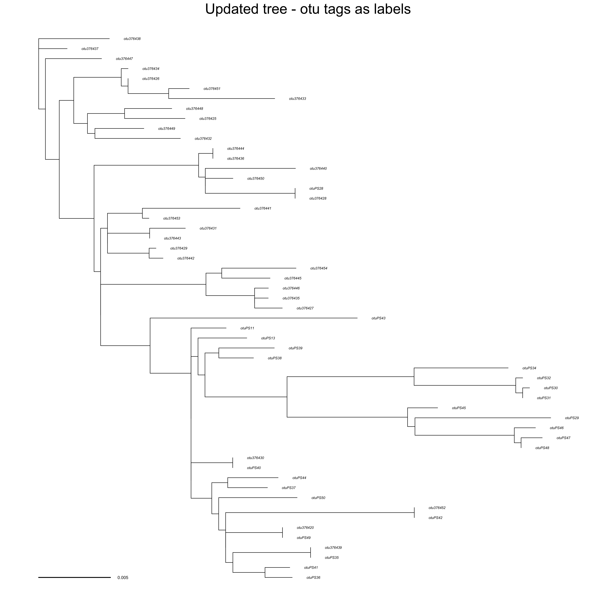
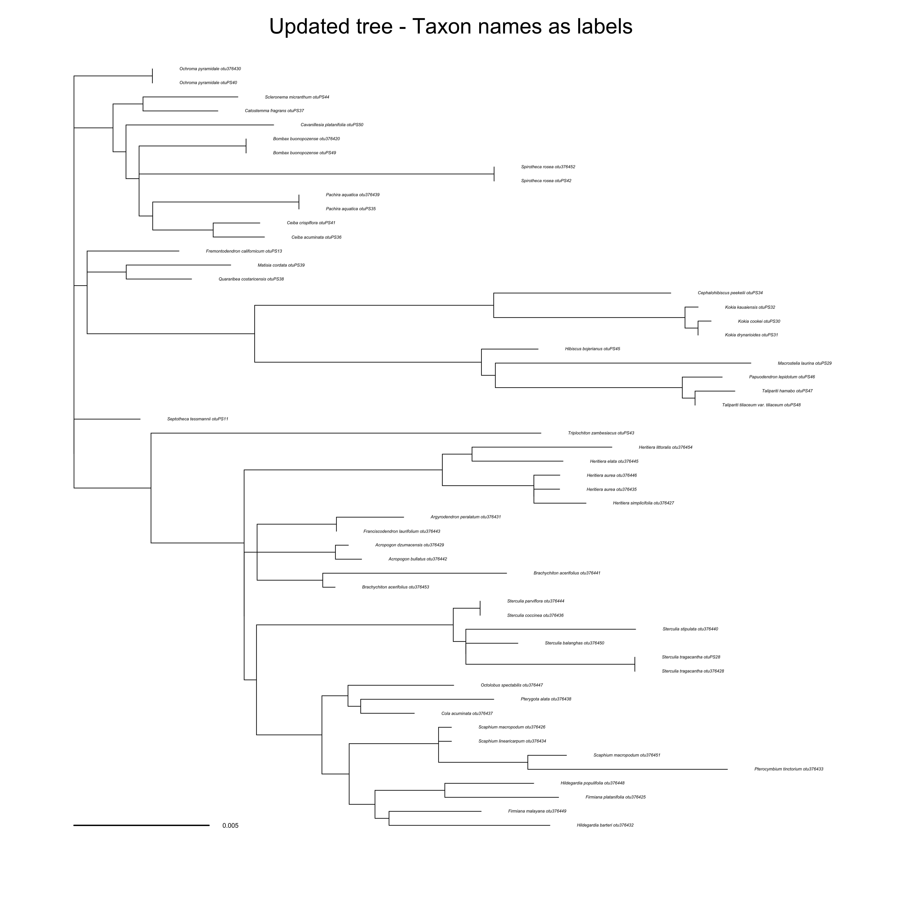
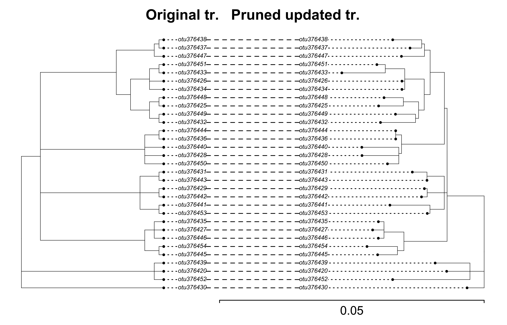

## I. Finding a tree to update

### With the Open Tree of Life website

Go to the [Open Tree of Life website](https://tree.opentreeoflife.org/opentree/argus/opentree12.3@ott93302) and use the "search for taxon" menu to look up the taxon **Malvaceae**.

This is how the genus **Malvaceae** is represented on the Open Tree of Life synthetic tree at the middle of year 2020:


***

Let's go to the [study curator of OToL](https://tree.opentreeoflife.org/curator) and look up for uploaded studies for the **Malvaceae**

Studies matching the word 'malvaceae' on the curator database, at the middle of year 2020. Some of these studies are not actually about the Malvaceae, but other taxa that have the keyword *malvaceae*.


***

### Finding a tree to update using the R package rotl

Explain what a focal clade is.

There is a handy function that will search a taxon among the focal clades reported across trees.


```r
studies <- rotl::studies_find_studies(property="ot:focalCladeOTTTaxonName", value="Malvaceae")
```


Table: Studies with the genus *Malvaceae* as focal clade.

|study_ids |n_trees |tree_ids                               |candidate |study_year |title |study_doi                                    |
|:---------|:-------|:--------------------------------------|:---------|:----------|:-----|:--------------------------------------------|
|pg_628    |3       |tree1029, tree1030, tree5358           |          |2011       |      |                                             |
|pg_629    |1       |tree1031                               |          |2010       |      |http://dx.doi.org/10.1600/036364411X553216   |
|pg_1855   |4       |tree3745, tree3746, tree3747, tree3748 |          |2007       |      |http://dx.doi.org/10.1600/036364407780360157 |

None of these trees are in the synthetic tree. Still, the family does not appear as a politomy and has phylogenetic information in the Open Tree of Life synthetic tree. Where is this information coming from?

It is probbaly coming from studies with focal clades that might be either above or below the particular clade you are interested in!

You can get supporting trees with the Open Tree of Life API, and you can currently do it now using some hidden `rotl` functions:


```r
res <- rotl:::.tol_subtree(ott_id=279960)
studies <- rotl:::studies_from_otl(res)
studies
#> $study_ids
#> [1] "ot_502"  "pg_2820" "ot_311"  "ot_1605" "pg_625" 
#> 
#> $trees
#> [1] "tree1"    "tree6566" "tree1"    "tree1"    "tree1016"
```


# Updating study `pg_55`


<!-- Get study data and tree id with rotl -->

```r
pg_55_meta = rotl::get_study_meta(study_id = "pg_55")
ls(pg_55_meta$nexml)
pg_55_meta$nexml$treesById
unlist(pg_55_meta$nexml$treesById)[1]
# rotl::taxonomy_taxon_info(pg_55_meta$nexml$"^ot:focalClade")
#>  [1] "@generator"                    "@id"                          
#>  [3] "@nexml2json"                   "@nexmljson"                   
#>  [5] "@version"                      "@xmlns"                       
#>  [7] "^ot:agents"                    "^ot:annotationEvents"         
#>  [9] "^ot:candidateTreeForSynthesis" "^ot:comment"                  
#> [11] "^ot:curatorName"               "^ot:dataDeposit"              
#> [13] "^ot:focalClade"                "^ot:focalCladeOTTTaxonName"   
#> [15] "^ot:otusElementOrder"          "^ot:studyId"                  
#> [17] "^ot:studyPublication"          "^ot:studyPublicationReference"
#> [19] "^ot:studyYear"                 "^ot:tag"                      
#> [21] "^ot:treesElementOrder"         "otusById"                     
#> [23] "treesById"                    
#> $trees55
#> $trees55$treeById
#> $trees55$treeById$tree5864
#> NULL
#> 
#> 
#> $trees55$`^ot:treeElementOrder`
#> $trees55$`^ot:treeElementOrder`[[1]]
#> [1] "tree5864"
#> 
#> 
#> $trees55$`@otus`
#> [1] "otus55"
#> 
#> 
#> trees55.^ot:treeElementOrder 
#>                   "tree5864"
```
***

The focal clade of study is **Sterculioideae.** Is this taxon in the synthetic tree? FALSE

Let's get the original tree and plot it here:


```r
original_tree <- rotl::get_study_tree(study_id = "pg_55", tree_id = "tree5864")
ape::plot.phylo(ape::ladderize(original_tree), type = "phylogram", cex = 0.3, label.offset = 1, edge.width = 0.5)
mtext("Original tree - original labels", side = 3, cex = 0.6)
```



***

Now, let's look at some properties of the tree:


```r
ape::Ntip(original_tree)  # gets the number of tips
#> [1] 31
ape::is.rooted(original_tree)  # check that it is rooted
#> [1] FALSE
ape::is.binary(original_tree)  # check that it is fully resolved
#> [1] FALSE
datelife::phylo_has_brlen(original_tree)  # checks that it has branch lengths
#> [1] FALSE
```
The tree has 31 tips, is rooted, has no branch lengths and is not fully resolved, as you probably already noticed. Also, labels correspond to the labels reported on the original study [here](http://dx.doi.org/10.1600/036364406775971714). Other labels are available to use as tip labels. For example, you can plot the tree using other labels, like the unified taxonomic names, or the taxonomic ids.

## II. Getting the underlying alignment

### Using physcraper and the arguments `-tb` and `-no_est`

This will download the alignment directly from TreeBASE:

```
physcraper_run.py -s pg_55 -t tree5864 -tb -no_est -o data/pg_55
```
The alignment will be saved as `pg_55tree5864.aln` and `physcraper_pg_55tree5864.fas` in the inputs folder.

### Downloading the alignment directly from a repository

We know that the alignments are in the TreeBASE repo at <https://treebase.org/treebase-web/search/study/matrices.html?id=1361>

Let's save them to a file named `TB2:Tr240.nex` in the `data-raw/alignments` folder:

```
wget -O data-raw/alignments/TB2:Tr240.nex "http://purl.org/phylo/treebase/phylows/tree/TB2:Tr240?format=nexus"
```

## III. Starting a physcraper run

We ran this example using the command:

```
physcraper_run.py -s pg_55 -t tree5864 -a data-raw/alignments/TB2:Tr240.nex -as nexus -o data/pg_55
```

## IV. Reading the physcraper results

### The physcraper tag

pg_55tree5864_ndhf

### Input files

Physcraper rewrites input files for a couple reasons: reproducibility, taxon name matching, and taxon reconciliation.
It writes the config file down if none was provided. Everything is written into the inputs_tag folder.

### Run files

Files in here are also automatically written down by physcraper.

blast runs, alignments, raxml trees, bootstrap

The trees are reconstructed using RAxML, with tip labels corresponding to local ids (e.g., otu42009, otuPS1) and not taxon names (e.g., *Ceiba*), nor taxonomic ids (e.g., ott or ncbi). Branch lengths are proportional to relative substitution rates.
The RAxML tree with taxon names as tip labels is saved on the `outputs_tag` folder.


```r
updated_tree_otus <- ape::read.tree(file = "../data/pg_55/run_pg_55tree5864_ndhf/RAxML_bestTree.2020-06-09")
ape::plot.phylo(ape::ladderize(updated_tree_otus), type = "phylogram", cex = 0.25, label.offset = 0.001, edge.width = 0.5)
ape::add.scale.bar(cex = 0.3, font = 1, col = "black")
mtext("Updated tree - otu tags as labels", side = 3)
```



### Output files

A number of files is automatically written down by physcraper.

A nexson tree with all types of tip labels is saved in here.
From this tree, a tree with any kind of label can be produced.
By default, the updtaed tree with taxon names as tip labels is saved
in the `output_tag` folder as `updated_taxonname.tre`.


```r
updated_tree_taxonname <- ape::read.tree(
  file = "../data/pg_55/outputs_pg_55tree5864_ndhf/updated_taxonname.tre")
```


```r
ape::plot.phylo(ape::ladderize(updated_tree_taxonname), type = "phylogram", cex = 0.2, label.offset = 0.001, edge.width = 0.5)
ape::add.scale.bar(cex = 0.3, font = 1, col = "black")
mtext("Updated tree - Taxon names as labels", side = 3)
```



## IV. Analyzing the physcraper results

Compare the original tree with the pruned updated tree

```r
original_tree_otus <- ape::read.tree(file = "../data/pg_55/inputs_pg_55tree5864_ndhf/physcraper_pg_55tree5864_ndhf.tre")
updated_tree_otus_pruned <- ape::read.tree(
  file = "../data/pg_55/pruned_updated.tre"
)
```


Now plot them face to face

We can prune the updated tree, so it is a straight forward comparison:

```r
cotree <-  phytools::cophylo(original_tree_otus, updated_tree_otus_pruned, rotate.multi =TRUE)
```

Rotating nodes to optimize matching...
Done.

```r
phytools::plot.cophylo(x = cotree, fsize = 0.5, lwd = 0.5, mar=c(.1,.2,2,.3), ylim=c(-.1,1), scale.bar=c(0, .05))
title("Original tr.   Pruned updated tr.", cex = 0.1)
```



But it is more interesting to plot it with all the new tips, so we see exactly where the new things are:

```r
original_tree_taxonname <- ape::read.tree(file = "../data/pg_55/inputs_pg_55tree5864_ndhf/taxonname.tre")
cotree2 <-  phytools::cophylo(
  original_tree_taxonname,
  updated_tree_taxonname,
  rotate.multi =TRUE)
```

Rotating nodes to optimize matching...
Done.

```r
phytools::plot.cophylo(
  x = cotree2,
  fsize = 0.3,
  lwd = 0.4,
  mar=c(.1,.1,2,.5),
  ylim=c(-.1,1),
  scale.bar=c(0, .05),
  # link.type="curved",
  link.lwd=3,
  link.lty="solid",
  link.col=phytools::make.transparent("#8B008B",0.5))
title("Original tree      Updated tree", cex = 0.1)
```


We can also plot the updated tree against the synthetic subtree of Malvaceae, to visualize how it updates our current knowledge of the phylogeentic relationships within the family:


```r
tolsubtree <- rotl::tol_subtree(ott_id = 279960)
ape::Ntip(tolsubtree)
#> [1] 5898
grep("Pterygota_alata", tolsubtree$tip.label)
#> [1] 5714
updated_tree_taxonname$tip.label
#>  [1] "Fremontodendron_californicum_otuPS13"       
#>  [2] "Quararibea_costaricensis_otuPS38"           
#>  [3] "Matisia_cordata_otuPS39"                    
#>  [4] "Hibiscus_bojerianus_otuPS45"                
#>  [5] "Macrostelia_laurina_otuPS29"                
#>  [6] "Talipariti_tiliaceum_var._tiliaceum_otuPS48"
#>  [7] "Talipariti_hamabo_otuPS47"                  
#>  [8] "Papuodendron_lepidotum_otuPS46"             
#>  [9] "Cephalohibiscus_peekelii_otuPS34"           
#> [10] "Kokia_kauaiensis_otuPS32"                   
#> [11] "Kokia_drynarioides_otuPS31"                 
#> [12] "Kokia_cookei_otuPS30"                       
#> [13] "Ochroma_pyramidale_otuPS40"                 
#> [14] "Ochroma_pyramidale_otu376430"               
#> [15] "Catostemma_fragrans_otuPS37"                
#> [16] "Scleronema_micranthum_otuPS44"              
#> [17] "Cavanillesia_platanifolia_otuPS50"          
#> [18] "Spirotheca_rosea_otuPS42"                   
#> [19] "Spirotheca_rosea_otu376452"                 
#> [20] "Bombax_buonopozense_otuPS49"                
#> [21] "Bombax_buonopozense_otu376420"              
#> [22] "Ceiba_acuminata_otuPS36"                    
#> [23] "Ceiba_crispiflora_otuPS41"                  
#> [24] "Pachira_aquatica_otuPS35"                   
#> [25] "Pachira_aquatica_otu376439"                 
#> [26] "Septotheca_tessmannii_otuPS11"              
#> [27] "Triplochiton_zambesiacus_otuPS43"           
#> [28] "Heritiera_elata_otu376445"                  
#> [29] "Heritiera_littoralis_otu376454"             
#> [30] "Heritiera_aurea_otu376446"                  
#> [31] "Heritiera_simplicifolia_otu376427"          
#> [32] "Heritiera_aurea_otu376435"                  
#> [33] "Brachychiton_acerifolius_otu376453"         
#> [34] "Brachychiton_acerifolius_otu376441"         
#> [35] "Acropogon_bullatus_otu376442"               
#> [36] "Acropogon_dzumacensis_otu376429"            
#> [37] "Franciscodendron_laurifolium_otu376443"     
#> [38] "Argyrodendron_peralatum_otu376431"          
#> [39] "Sterculia_balanghas_otu376450"              
#> [40] "Sterculia_tragacantha_otu376428"            
#> [41] "Sterculia_tragacantha_otuPS28"              
#> [42] "Sterculia_stipulata_otu376440"              
#> [43] "Sterculia_coccinea_otu376436"               
#> [44] "Sterculia_parviflora_otu376444"             
#> [45] "Hildegardia_barteri_otu376432"              
#> [46] "Firmiana_malayana_otu376449"                
#> [47] "Firmiana_platanifolia_otu376425"            
#> [48] "Hildegardia_populifolia_otu376448"          
#> [49] "Scaphium_linearicarpum_otu376434"           
#> [50] "Scaphium_macropodum_otu376426"              
#> [51] "Pterocymbium_tinctorium_otu376433"          
#> [52] "Scaphium_macropodum_otu376451"              
#> [53] "Octolobus_spectabilis_otu376447"            
#> [54] "Cola_acuminata_otu376437"                   
#> [55] "Pterygota_alata_otu376438"
```
Eliminate ott and otu tags before comparison, otherwise nothing matches
# ```{r cotree-plot3, message = FALSE, eval = TRUE, dpi = 300, fig.retina = 3, results="asis", out.width="90%",  out.extra='style="background-color: #8B008B; padding:10px; display: inline-block;"', fig.height=7.5}
# cotree2 <-  phytools::cophylo(tolsubtree, updated_tree_taxonname, rotate.multi =TRUE)
# phytools::plot.cophylo(x = cotree2, fsize = 0.2, lwd = 0.5, mar=c(.1,.1,2,.3), ylim=c(-.1,1), scale.bar=c(0, .05))
# title("Tol subtree      Updated tree", cex = 0.1)
# ```

# References

Trick for the cophylo titles and margins from https://cran.r-project.org/web/packages/phangorn/vignettes/IntertwiningTreesAndNetworks.html
