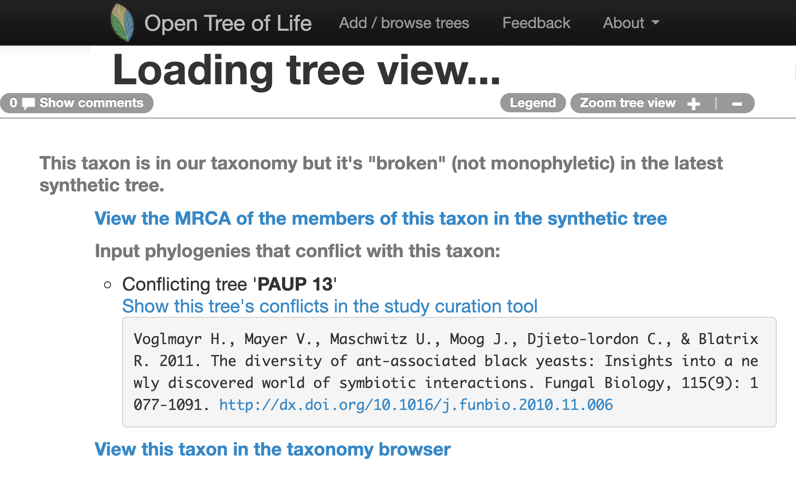
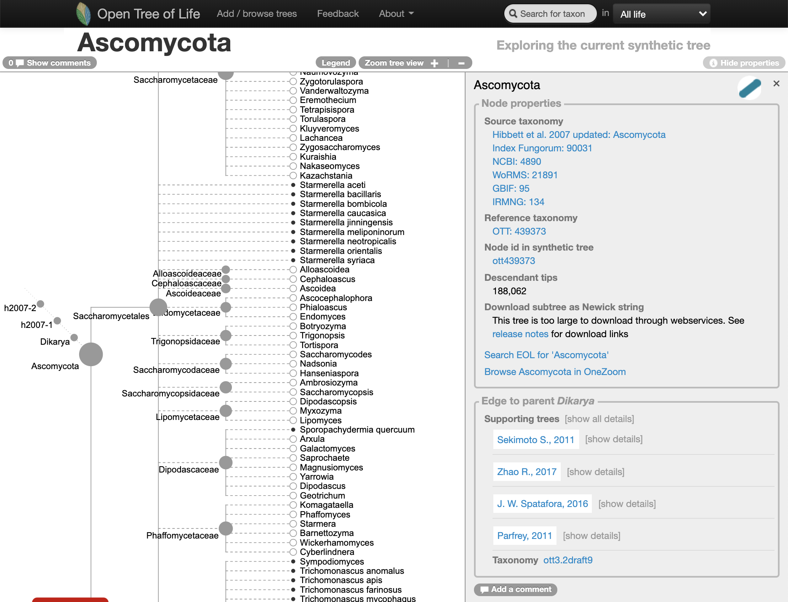
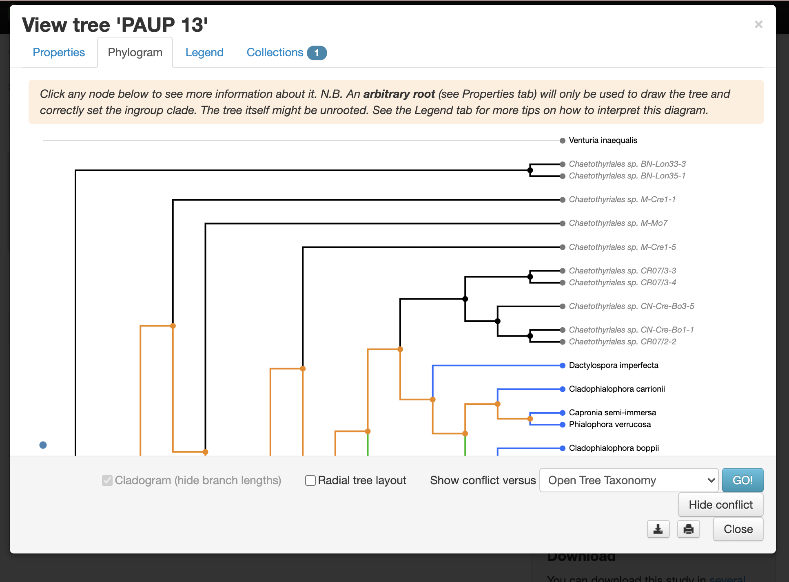
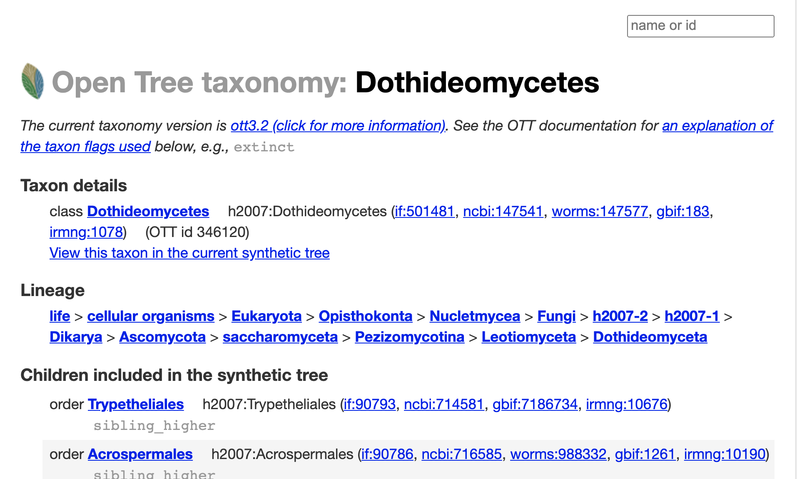
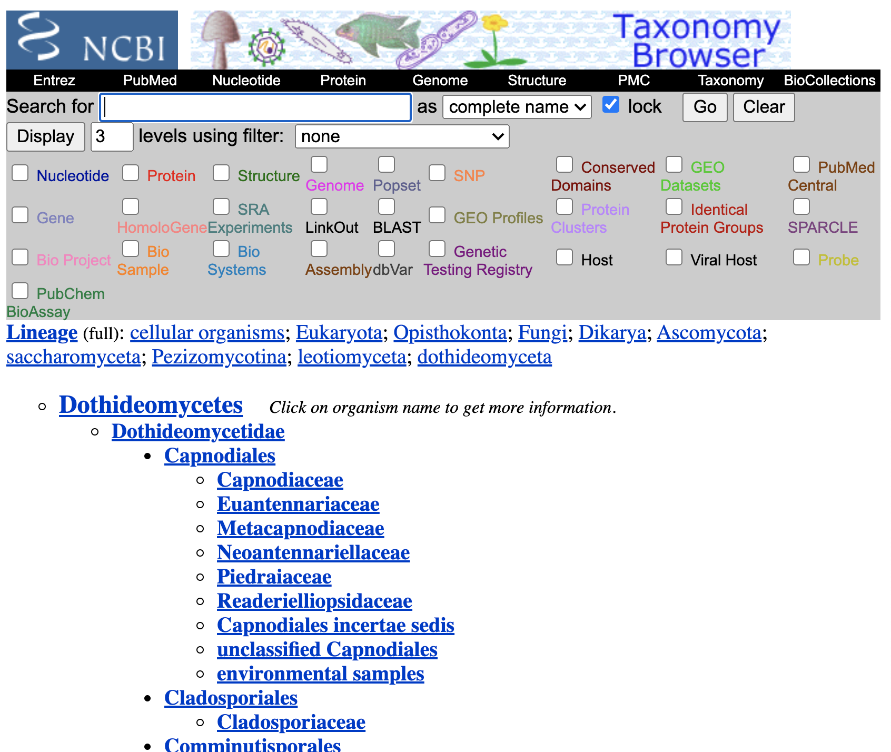

```{r, include = FALSE}
knitr::opts_chunk$set(
  collapse = TRUE,
  comment = "#>"
)
knitr::opts_knit$set(
  global.par = TRUE
  )
options(rmarkdown.html_vignette.check_title = FALSE)

```

```{r setup, echo=FALSE}
library(DT)
```
## I. Finding a tree to update

### With the Open Tree of Life website

Go to the [Open Tree of Life website](https://tree.opentreeoflife.org/opentree/argus/opentree12.3@ott93302) and use the "search for taxon" menu to look up the taxon
Dothideomycetes.

Oh no... it seems like the Dothideomycetes are not represented as a clade on the Open Tree of Life synthetic tree (at the middle of year 2020):

```{r dothideomycetes-tree-opentree, echo=FALSE, fig.cap="Go to the website and look at it [here](https://tree.opentreeoflife.org/opentree/argus/ottol@346120/Dothideomycetes)", out.width = '100%', fig.retina= 2}


```

***

What is the MRCA of the "broken" Dothideomycetes in the synthetic tree?
follow the ["View the MRCA of the members of this taxon in the synthetic tree"](https://tree.opentreeoflife.org/opentree/argus/ottol@439373/Ascomycota) link.

```{r ascomycota-tree-opentree, echo=FALSE, fig.cap="", out.width = '100%', fig.retina= 2}


```

It is the Ascomycota, which has more than 1.5k species.

It is time now to ask the question, do we want to update an alignment for all the Ascomycota???

***

Why are the Dothideomycetes "broken"?

go to the ["Show this tree's conflicts in the study curation tool"](https://tree.opentreeoflife.org/curator/study/view/ot_1477/?tab=home&tree=Tr25846&conflict=ott) link.

```{r dothideomycetes-conflict-opentree, echo=FALSE, fig.cap="", out.width = '100%', fig.retina= 2}


```

There is a published tree that is conflicting with the taxonomy.

***

Let's get more information about the taxonomy of the Dothideomycetes, follow the ["View this taxon in the taxonomy browser"](https://tree.opentreeoflife.org/taxonomy/browse?id=346120) link.

```{r dothideomycetes-taxonomy-opentree, echo=FALSE, fig.cap="", out.width = '100%', fig.retina= 2}


```

So, it seems like it is a taxon in NCBI. To verify this, go to the section "Taxon details", and follow the [ncbi:147541](https://www.ncbi.nlm.nih.gov/Taxonomy/Browser/wwwtax.cgi?id=147541) link.

```{r dothideomycetes-ncbi, echo=FALSE, fig.cap="", out.width = '100%', fig.retina= 2}


```

Maybe we can just enrich that part of the tree on the updating step.

***

Let's verify that on the [study curator of OToL](https://tree.opentreeoflife.org/curator).

Studies matching the word 'dothideomycetes' on the curator database, at the middle of year 2020. Some of these studies are not actually about this taxon.

```{r dothideomycetes-curation-opentree, echo=FALSE, fig.cap="", out.width = '100%', fig.retina= 2}
knitr::include_graphics(c("dothideomycetes-curation-opentree-1-2020-06-06.png", "dothideomycetes-curation-opentree-2-2020-06-06.png", "dothideomycetes-curation-opentree-3-2020-06-06.png"))
```

### Finding a tree to update using the R package rotl

Explain what a focal clade is.

There is a handy function that will search a taxon among the focal clades reported across trees.

```{r}
doth <- rotl::studies_find_studies(property="ot:focalCladeOTTTaxonName", value="Dothideomycetes")

```

<!-- ```{bash} -->
<!-- curl -X POST https://api.opentreeoflife.org/v3/studies/find_studies \ -->
<!-- -H "content-type:application/json" -d \ -->
<!-- '{"property":"ot:studyId","value":"pg_254","verbose":true}' -->

<!-- curl -X POST https://api.opentreeoflife.org/v3/studies/find_studies \ -->
<!-- -H "content-type:application/json" -d \ -->
<!-- '{"property":"ot:focalCladeOTTTaxonName","value":"Ilex","verbose":true}' -->

<!-- curl -X POST https://api.opentreeoflife.org/v3/studies/find_studies \ -->
<!-- -H "content-type:application/json" -d \ -->
<!-- '{"property":"ot:focalCladeTaxonName","value":"ilex","verbose":true}' -->
<!-- ``` -->

```{r, results='asis', echo=FALSE}
# knitr::kable(doth, caption = "Studies with the class **Dothideomycetes** as focal clade.")
issue_title <- doth[,"study_ids"] %in% "ot_465"
doth[issue_title, "title"] <- "Resolving Tiarosporella spp. allied to Botryosphaeriaceae and Phacidiaceae"
datatable(doth, class = 'order-column hover compact row-border', options = list(dom = 't'), rownames = FALSE, editable = FALSE) # %>%
```

It seems like the tree *tree137* from study *pg_254*, is **not** in the Open Tree of Life synthetic tree.

Let's get it and plot it here:


```{r,include=FALSE}
par(mar=c(0,1,0,0), xpd=NA)  # adjust margins for all plots after this
```
```{r schoch-pg_254-tree137, message = FALSE, eval = TRUE, dpi = 300, fig.retina = 3, fig.width = 2, out.width="100%", fig.height = 20}
schoch2009 <- rotl::get_study_tree(study_id = "pg_254", tree_id = "tree137")
ape::plot.phylo(ape::ladderize(schoch2009), type = "phylogram", cex = 0.3, label.offset = 1, edge.width = 0.5)
```


The alignment is here <https://treebase.org/treebase-web/search/study/matrices.html?id=10245>.

```
wget "http://purl.org/phylo/treebase/phylows/matrix/TB2:M4727?format=nexus" mv TB2:M4727?format=nexus data-raw/alignments/T6859-M4727.nex
```

# Ascomycota

```{r}
asco <- rotl::studies_find_studies(property="ot:focalCladeOTTTaxonName", value="Ascomycota")
datatable(asco, class = 'order-column hover compact row-border', options = list(dom = 't'), rownames = FALSE, editable = FALSE)
knitr::kable(asco, caption = "Studies with the **Ascomycota** as focal clade.")
```

It seems like the tree *tree109* from study *pg_238*, is **not** in the Open Tree of Life synthetic tree.

Ascomycota alignments here <https://treebase.org/treebase-web/search/study/matrices.html?id=2137>.

```
wget "http://purl.org/phylo/treebase/phylows/matrix/TB2:M3939?format=nexus"
mv TB2:M3939?format=nexus data-raw/alignments/Tr5276-M3939.nex

wget "http://purl.org/phylo/treebase/phylows/matrix/TB2:M3938?format=nexus"
mv TB2:M3938?format=nexus data-raw/alignments/Tr5276-M3938.nex

wget "http://purl.org/phylo/treebase/phylows/matrix/TB2:M3802?format=nexus"
mv TB2:M3802?format=nexus data-raw/alignments/Tr5276-M3802.nex

wget "http://purl.org/phylo/treebase/phylows/matrix/TB2:M3956?format=nexus"
mv TB2:M3956?format=nexus data-raw/alignments/Tr5276-M3956.nex
```

Downloading them with physcraper
```
physcraper_run.py -s pg_238 -t tree109 -tb -no_est -o ../physcraperex/data/schoch_ascomycota_0_2020.06.06
```

# Current run
```
physcraper_run.py -s pg_238 -t tree109 -a ../physcraperex/data-raw/alignments/Tr5276-M3939-mod.nex -as nexus  -db /branchinecta/shared/local_blast_db -o ../physcraperex/data/schoch_ascomycota_1_2020.06.06
```
